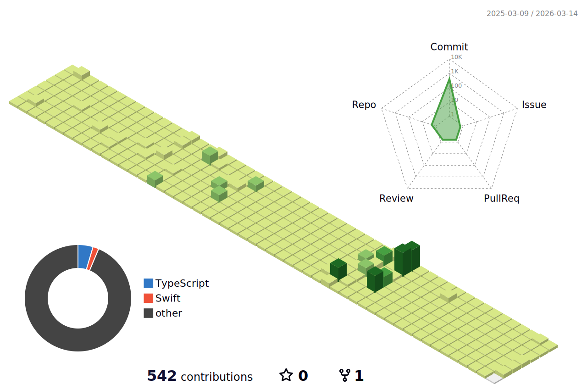

# 초심자 주의구역  :warning::poop:

## :closed_book: About Me

개발자(지망생) :beginner:

## :boom: Skills

### :relieved: Languages 

##### Most Used Language

  

### Frameworks & Libraries

  

### Tools & Platforms

  

## Projects

### 포트폴리오 사이트 프로젝트
**[메인 레포지토리](https://github.com/HanSeooooL/23WvacPortfoliosite)**
**[API 서버](https://github.com/HanSeooooL/23Wvacportfoliosite_APIServer)**

- **Description:** 지금까지 진행한 프로젝트와 커리어들을 기록 할 수 있는 사이트.
- **Tech Stack:** Next.js, Express.js
- **Highlights:**
  - 얻은 커리어를 입력 및 보관
  - 버튼 클릭으로 이력서로 변환

### [Project Name 2](https://github.com/yourusername/projectname2)

- **Description:** 프로젝트 2에 대한 간단한 설명.
- **Tech Stack:** 사용된 주요 기술들 (예: Python, Django, PostgreSQL)
- **Highlights:**
  - 주요 기능 1
  - 주요 기능 2
  - 주요 기능 3

## GitHub Stats

## Contact

- **Email:** fnsonle@gmail.com
- **Instagram:** [@iamwhitepepper](https://www.instagram.com/iamwhitepepper)

---

*이 프로필은 [홍서빈](https://github.com/hsbbsh)이 ❤️를 담아 작성했습니다.*

<!--
**HanSeooooL/HanSeooooL** is a ✨ _special_ ✨ repository because its `README.md` (this file) appears on your GitHub profile.

Here are some ideas to get you started:

- 🔭 I’m currently working on ...
- 🌱 I’m currently learning ...
- 👯 I’m looking to collaborate on ...
- 🤔 I’m looking for help with ...
- 💬 Ask me about ...
- 📫 How to reach me: ...
- 😄 Pronouns: ...
- ⚡ Fun fact: ...
-->
