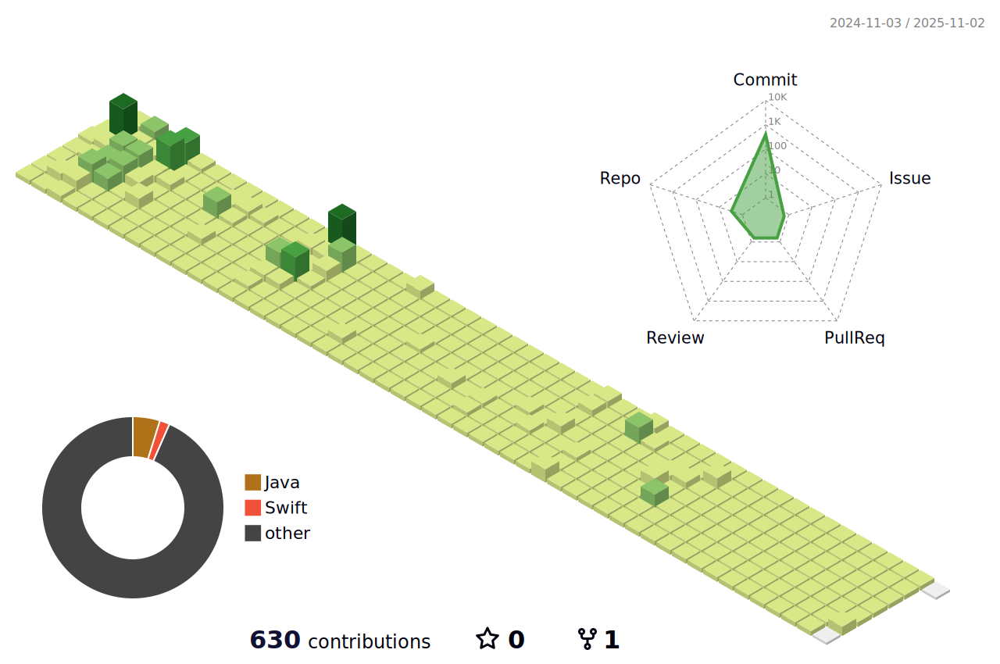

# This is HanSeol's Area  :imp::poop:

## :closed_book: About Me

개발자(지망생)

## :boom: Skills

### :relieved: Languages 

##### Most Used Language

  

### Frameworks & Libraries

  

### Tools & Platforms

  

## Projects

### [Project Name 1](https://github.com/HanSeooooL/projectname1)

- **Description:** 프로젝트 1에 대한 간단한 설명.
- **Tech Stack:** 사용된 주요 기술들 (예: React, Node.js, MongoDB)
- **Highlights:**
  - 주요 기능 1
  - 주요 기능 2
  - 주요 기능 3

### [Project Name 2](https://github.com/yourusername/projectname2)

- **Description:** 프로젝트 2에 대한 간단한 설명.
- **Tech Stack:** 사용된 주요 기술들 (예: Python, Django, PostgreSQL)
- **Highlights:**
  - 주요 기능 1
  - 주요 기능 2
  - 주요 기능 3

## GitHub Stats

## Contact

- **Email:** fnsonle@gmail.com
- **Instagram:** [@iamwhitepepper](https://www.instagram.com/iamwhitepepper)

---

*이 프로필은 [홍서빈](https://github.com/hsbbsh)이 ❤️를 담아 작성했습니다.*

<!--
**HanSeooooL/HanSeooooL** is a ✨ _special_ ✨ repository because its `README.md` (this file) appears on your GitHub profile.

Here are some ideas to get you started:

- 🔭 I’m currently working on ...
- 🌱 I’m currently learning ...
- 👯 I’m looking to collaborate on ...
- 🤔 I’m looking for help with ...
- 💬 Ask me about ...
- 📫 How to reach me: ...
- 😄 Pronouns: ...
- ⚡ Fun fact: ...
-->
